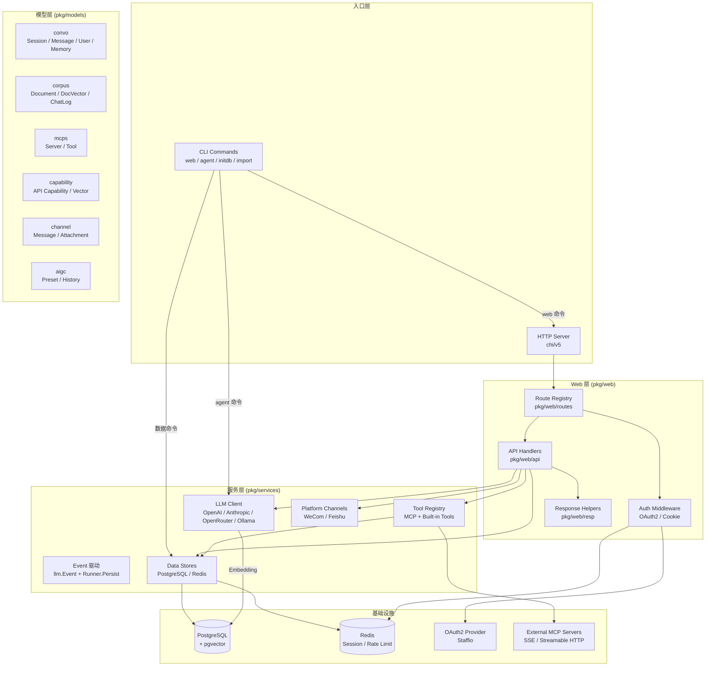
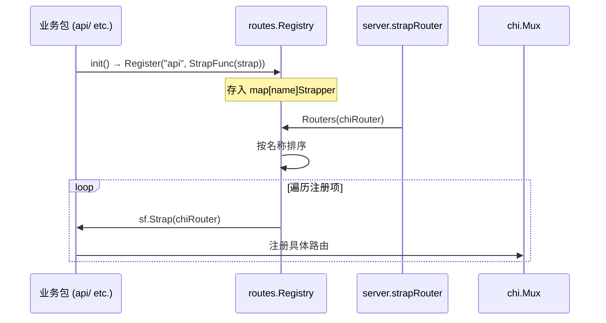

# Morign 系统架构文档

## 1. 架构总览



## 2. 分层架构

```
┌─────────────────────────────────────────────────────┐
│                    main.go                          │
│         CLI Entry (urfave/cli) + Web Server          │
├─────────────────────────────────────────────────────┤
│                 Web Layer (pkg/web)                  │
│  ┌──────────┐ ┌──────────┐ ┌────────┐ ┌─────────┐  │
│  │  server  │ │  routes  │ │  api   │ │  resp   │  │
│  │ chi mux  │ │ registry │ │handler │ │ helpers │  │
│  └──────────┘ └──────────┘ └────────┘ └─────────┘  │
├─────────────────────────────────────────────────────┤
│              Service Layer (pkg/services)            │
│  ┌──────────┐ ┌──────────┐ ┌──────────┐ ┌───────┐  │
│  │   llm    │ │  event   │ │  runner  │ │channels│  │
│  │ client   │ │ Event驱动 │ │ Persist  │ │ wecom  │  │
│  │ provider │ │          │ │统一持久化 │ │ feishu │  │
│  └──────────┘ └──────────┘ └──────────┘ └───────┘  │
├─────────────────────────────────────────────────────┤
│               Model Layer (pkg/models)               │
│  ┌──────────┐ ┌──────────┐ ┌──────────┐ ┌───────┐  │
│  │  convo   │ │  corpus  │ │   mcps   │ │ aigc  │  │
│  │ session  │ │ document │ │  server  │ │ preset │  │
│  │ message  │ │ docVector│ │  tool    │ │history │  │
│  │ memory   │ │ chatLog  │ │          │ │ match  │  │
│  │ user     │ │          │ │          │ │       │  │
│  └──────────┘ └──────────┘ └──────────┘ └───────┘  │
│  ┌──────────┐ ┌──────────┐                          │
│  │capability│ │ channel  │                          │
│  │ api spec │ │ message  │                          │
│  │ vector   │ │          │                          │
│  └──────────┘ └──────────┘                          │
├─────────────────────────────────────────────────────┤
│           Infrastructure (pkg/settings)              │
│  ┌──────────┐ ┌──────────┐ ┌──────────────────┐    │
│  │PostgreSQL│ │  Redis   │ │ External Services │    │
│  │+pgvector │ │ cache    │ │ OAuth / MCP / LLM│    │
│  └──────────┘ └──────────┘ └──────────────────┘    │
└─────────────────────────────────────────────────────┘
```

## 3. 路由注册机制

项目使用插件式路由注册：各业务包通过 `init()` 调用 `routes.Register()` 注册自己的路由挂载函数，服务启动时 `routes.Routers()` 按名称排序统一挂载。


