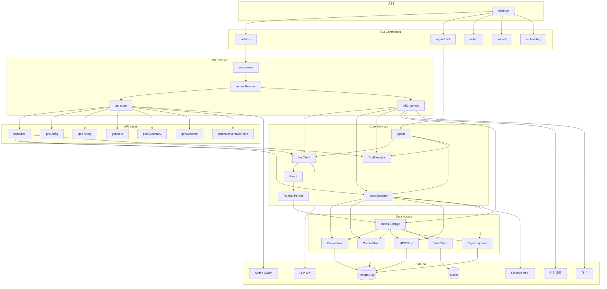
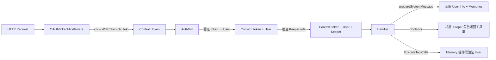
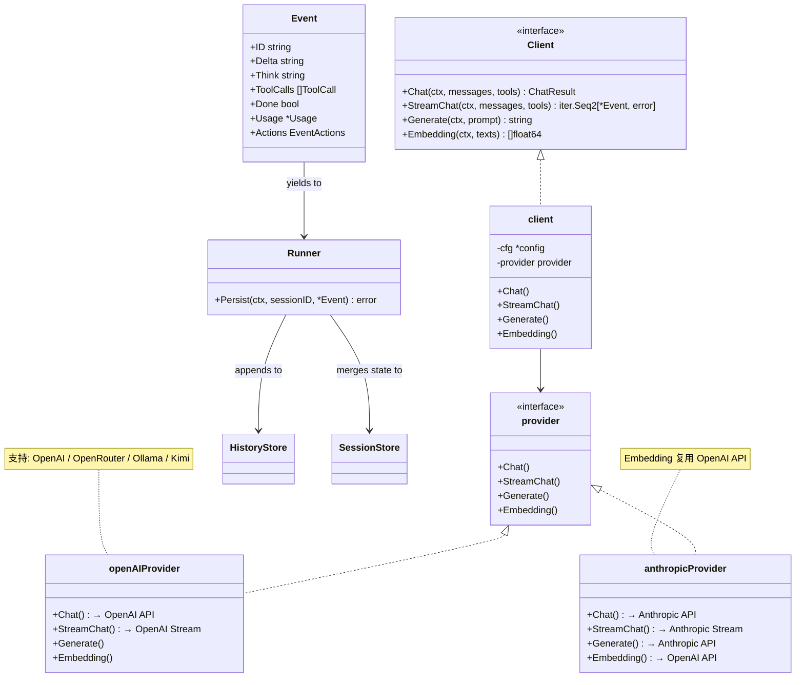

# Morign 组件交互与依赖

## 1. 核心组件依赖图



## 2. 请求处理管道

```
HTTP Request
    │
    ▼
┌─────────────────┐
│  chi.Mux        │ ← middleware.RealIP, recoverer
└────────┬────────┘
         │
    ┌────▼────────────────────────────┐
    │  OAuthTokenMiddleware           │ ← 注入 OAuth Token 到 Context
    └────┬────────────────────────────┘
         │
    ┌────▼────────────────────────────┐
    │  routes.AuthMw(false)           │ ← 提取 User / Keeper 信息
    └────┬────────────────────────────┘
         │
    ┌────▼────────────────────────────┐
    │  Rate Limiter (opt.)            │ ← Redis 限流 (仅 /chat)
    └────┬────────────────────────────┘
         │
    ┌────▼────────────────────────────┐
    │  Handler (postChat etc.)        │
    └────────────────────────────────┘
```

## 3. Context 注入链



## 4. 工具注册与调用全景

```
┌──────────────────────────────────────────────────────────────┐
│                    tools.Registry                             │
│                                                              │
│  ┌─────────────┐  ┌──────────────┐  ┌────────────────────┐  │
│  │   tools[]    │  │  invokers{}  │  │  servers{}         │  │
│  │ ToolDescriptor│  │ name→Invoker│  │ name→MCPConnection │  │
│  └──────┬───────┘  └──────┬───────┘  └─────────┬──────────┘  │
│         │                 │                     │             │
└─────────┼─────────────────┼─────────────────────┼─────────────┘
          │                 │                     │
          ▼                 ▼                     ▼
┌──────────────────────────────────────────────────────────────┐
│                      内置工具 (Built-in)                       │
├──────────────┬──────────────┬──────────────┬─────────────────┤
│  kb_search   │  kb_create   │    fetch     │   memory_*      │
│  pgvector    │  INSERT Doc  │  HTTP GET    │   CRUD Memory   │
│  相似度匹配   │  (Keeper)    │  HTML→MD     │   + 向量化       │
├──────────────┴──────────────┼──────────────┼─────────────────┤
│        capability_match     │capability_invoke              │
│        向量匹配 API          │ HTTP 调用 Bus API              │
└─────────────────────────────┴────────────────────────────────┘

┌──────────────────────────────────────────────────────────────┐
│                    MCP 工具 (Remote)                          │
├─────────────────────┬────────────────────────────────────────┤
│    OAuth MCP        │        Strata MCP (Shell)              │
│    Streamable HTTP  │        Streamable HTTP                 │
│    Authorization头   │        OwnerID + SessionID 头          │
└─────────────────────┴────────────────────────────────────────┘
```

## 5. LLM Provider 适配


