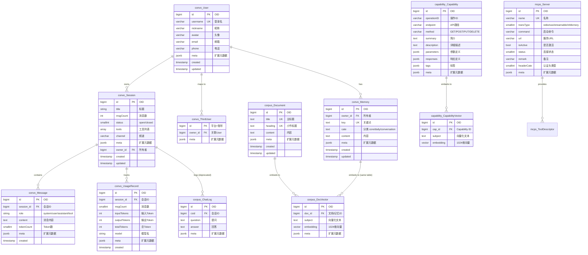

# Morign 数据模型与实体关系

## 1. 实体关系总览



## 2. 核心实体关联图

```
┌──────────────┐     ┌──────────────────┐     ┌─────────────────┐
│  convo_User  │────→│   convo_Session   │────→│  convo_Message   │
│              │     │                   │     │                  │
│  username    │     │  title            │     │  role            │
│  nickname    │     │  status           │     │  content         │
│  avatar      │     │  tools[]          │     │  tokenCount      │
│  email       │     │  channel          │     │                  │
└──────────────┘     └──────────────────┘     └─────────────────┘
       │                      │
       │                      ├──────────────────┐
       │                      │                  │
       ▼                      ▼                  ▼
┌──────────────┐     ┌──────────────────┐     ┌─────────────────┐
│convo_ThirdUsr│     │convo_UsageRecord │     │  corpus_ChatLog  │
│              │     │                  │     │  (deprecated)    │
│  owner_id ───┼─────│  inputTokens     │     │  csid            │
│  platform+uid│     │  outputTokens    │     │  question        │
└──────────────┘     │  model           │     │  answer          │
                     └──────────────────┘     └─────────────────┘

┌──────────────┐     ┌──────────────────┐
│  convo_Memory│────→│  corpus_DocVector │←────│ corpus_Document │
│              │     │                   │     │                  │
│  owner_id    │     │  doc_id (FK)      │     │  title           │
│  key         │     │  subject          │     │  heading         │
│  cate        │     │  embedding(1024)  │     │  content         │
│  content     │     │                   │     │                  │
└──────────────┘     └──────────────────┘     └──────────────────┘
                              ▲
                              │
                     ┌────────┴─────────┐
                     │capability_CapVector│
                     │                   │
                     │  cap_id (FK)      │
                     │  subject          │
                     │  embedding(1024)  │
                     └───────────────────┘
                              │
                              ▼
                     ┌───────────────────┐
                     │capability_Capability│
                     │                   │
                     │  endpoint         │
                     │  method           │
                     │  parameters       │
                     │  responses        │
                     └───────────────────┘

┌──────────────┐
│  mcps_Server │
│              │
│  name        │──────── 对外 MCP 工具（运行时加载，不持久化到独立表）
│  transType   │
│  url         │
│  isActive    │
│  headerCate  │
└──────────────┘
```

## 3. 关键数据表说明

| 表名 | 用途 | 关键字段 |
|------|------|---------|
| `convo_session` | 会话管理，每次对话一个 Session | `title`, `status`, `tools`, `channel`, `owner_id` |
| `convo_message` | 会话消息（新架构，迁移中） | `session_id`, `role`, `content`, `tokenCount` |
| `convo_user` | 用户信息，OAuth 登录同步 | `username`(唯一), `nickname`, `avatar` |
| `convo_third_user` | 第三方平台用户映射（微信/飞书） | PK=平台前缀+UID, `owner_id`→User |
| `convo_memory` | 用户长期记忆 | `owner_id`+`key`(联合唯一), `cate`, `content` |
| `convo_usage_record` | Token 用量追踪 | `session_id`, `inputTokens`, `outputTokens`, `model` |
| `corpus_document` | 知识库文档 | `title`+`heading`(联合唯一), `content` |
| `corpus_vector_400` | 向量存储（文档+记忆共用） | `doc_id`, `embedding`(1024维), `subject` |
| `mcp_server` | MCP 服务器配置 | `name`(唯一), `transType`, `url`, `isActive`, `headerCate` |
| `api_capability` | OpenAPI/Swagger 导入的 API 能力 | `endpoint`, `method`, `parameters`(jsonb) |
| `api_capability_vector` | API 能力语义向量 | `cap_id`, `embedding`(1024维) |
