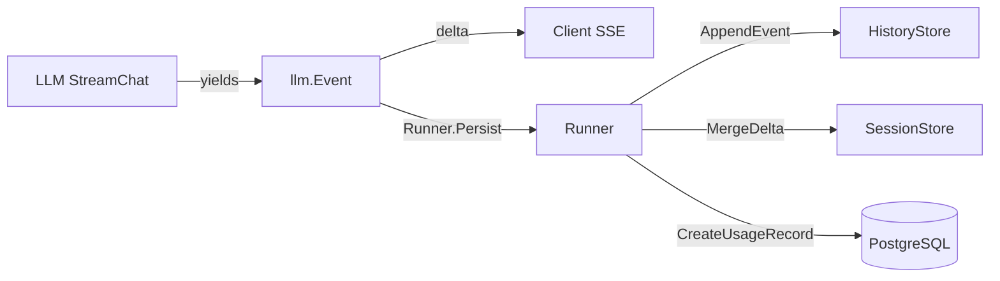
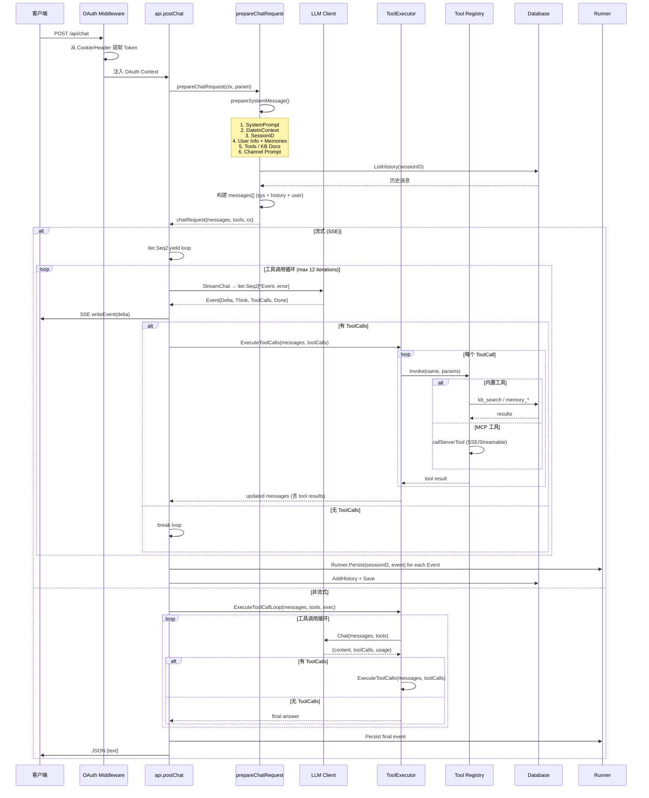
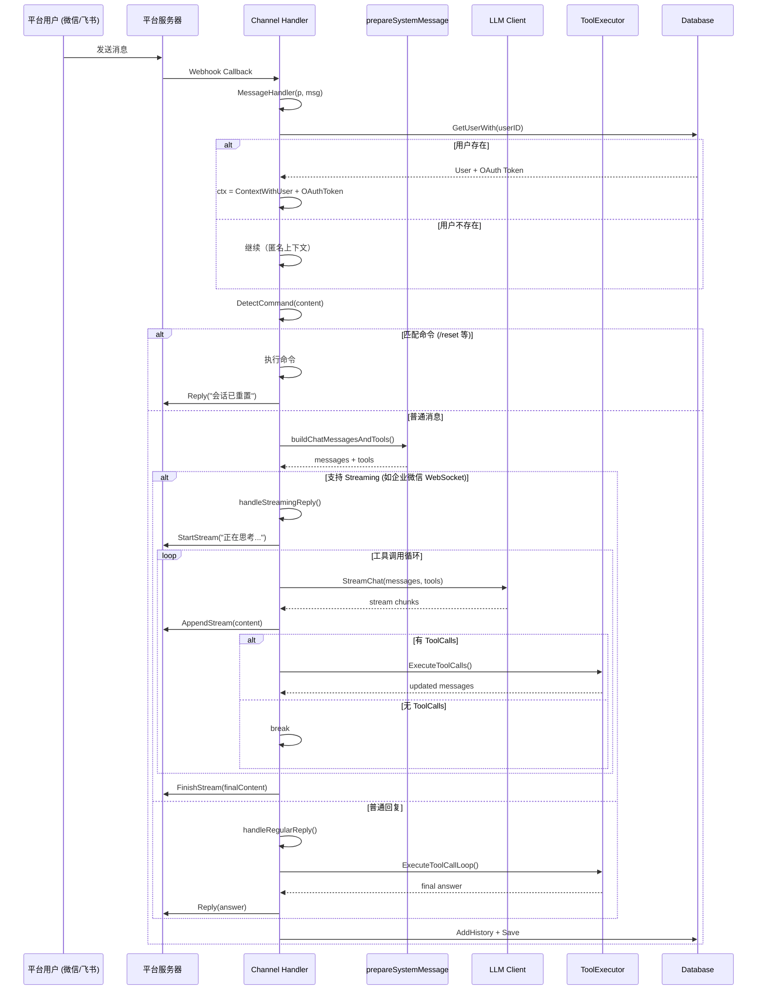
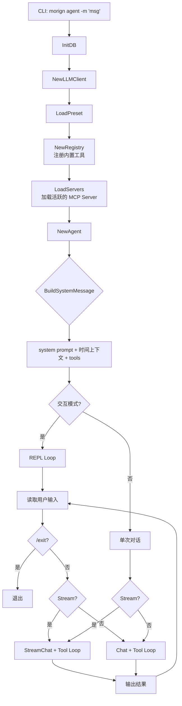
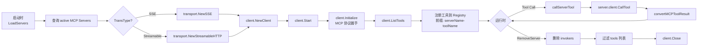
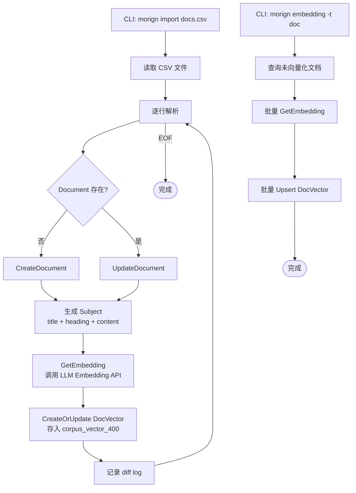

# Morign 核心工作流

## 0. Event 驱动架构



- **Event**: 统一的事件结构体 (`llm.Event`)，包含 Delta、Think、ToolCalls、Usage、Actions 等
- **Runner.Persist**: 统一持久化入口，同时处理历史追加、状态合并、用量记录
- **HistoryStore / SessionStore**: 通过适配器模式对接 `stores.Storage`

## 1. Web Chat 完整流程



## 2. Platform Channel 消息流程



## 3. CLI Agent 流程



## 4. 工具调用执行流程

```mermaid
flowchart TD
    Start([LLM 返回 ToolCalls]) --> Check{len(toolCalls) > 0?}
    Check -->|否| Done([返回最终回答])
    Check -->|是| Append[追加 Assistant Message<br/>含 tool_calls + thinking]

    Append --> Loop[遍历每个 ToolCall]
    Loop --> Parse[解析 Arguments JSON]
    Parse --> Invoke[Registry.Invoke(name, params)]

    Invoke --> Match{工具类型?}
    Match -->|kb_search| KB[(知识库<br/>pgvector 相似度匹配)]
    Match -->|kb_create| KBCreate[(写入 Document)]
    Match -->|memory_*| Mem[(用户记忆 CRUD<br/>含向量化)]
    Match -->|fetch| Fetch[HTTP GET<br/>HTML→Markdown]
    Match -->|capability_*| Cap[(API 能力匹配<br/>+ HTTP 调用 Bus)]
    Match -->|MCP Server| MCP[远程 MCP 调用<br/>SSE / Streamable HTTP]

    KB --> Result[formatToolResult]
    KBCreate --> Result
    Mem --> Result
    Fetch --> Result
    Cap --> Result
    MCP --> Result

    Result --> AppendTR[追加 Tool Message<br/>role=tool, content=result]
    AppendTR --> Loop

    Loop --> |所有 ToolCall 处理完| BackToLLM[返回 updated messages]
    BackToLLM --> Start
```

## 5. MCP Server 连接生命周期



## 6. 知识库文档导入与向量化流程


