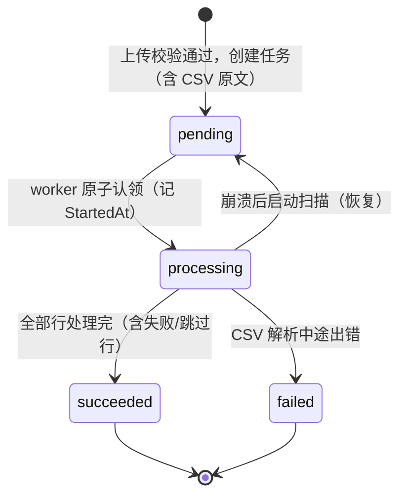

# ImportDocs 异步导入 API

## Summary

通过 `docs/corpus.yaml` 的代码生成建立 `ImportTask` / `ImportFailure` / `ImportTaskStatus` 模型与基础存储方法，在 stores 层实现"任务即队列"的导入执行与串行 worker（含崩溃恢复），并新增三个自定义 API 端点（上传、列表、详情），全部按 Keeper 权限控制。

---

## Problem Frame

当前文档导入只有 CLI，管理后台无法自助上传；导入逐行调用 embedding，耗时长，同步 HTTP 会占住连接且无法反馈进度与失败原因（详见 origin 文档 Problem Frame）。本计划在已确认的单实例部署下，用最小机制解决：任务落 Postgres、进程内串行消费、重启自愈。

---

## Requirements

以下 R-ID 与 origin 文档对应，计划必须满足：

- R1. 上传 CSV 创建任务（初始 pending）；表头不合法或非 UTF-8 直接拒绝
- R2. CSV 内容随任务持久化，worker 从任务记录读取
- R3. 进程内串行消费，同一时间一个任务
- R4. 容错继续：单行失败记录原因跳过、不重试；任务正常结束为已完成
- R5. 重复行（title+heading 已存在）跳过并记录，不覆盖已有文档
- R6. 任务记录计数（total/success/failed/skipped）、失败与跳过明细、开始与完成时间
- R7. 重启后自动恢复 pending/processing 任务，重复处理不产生重复文档
- R8. 列表按创建倒序、可按状态筛选、不返回 CSV 原文；详情含失败与跳过明细
- R9. 上传与查询仅 Keeper 角色可访问

**Origin actors:** A1（管理后台用户）、A2（后台 worker）
**Origin flows:** F1（上传导入）、F2（状态查看）、F3（崩溃恢复）
**Origin acceptance examples:** AE1（2 行失败仍完成）、AE2（坏表头/非 UTF-8 拒绝）、AE3（重复行跳过且不覆盖）、AE4（崩溃恢复不重复）

---

## Scope Boundaries

- 不做取消任务、并发多任务、实时行级进度推送
- 不引入 Redis Stream / LISTEN-NOTIFY
- 不支持多文件/多格式上传
- 不做失败行重试/重新提交
- 不做任务完成通知；任务历史保留策略搁置（v1 无自动清理）
- 不为任务表生成标准 webapi CRUD 端点（上传与查询为自定义 handler）

### Deferred to Follow-Up Work

- 任务历史自动清理/保留策略：后续迭代（任务表持续累积）
- 失败行重新提交（基于明细重导）：后续迭代

---

## Context & Research

### Relevant Code and Patterns

- 代码生成：`make codegen` 对 `docs/*.yaml` 执行 scaffold codegen（`-spec 7`），生成 `pkg/models/corpus/corpus_gen.go`、`pkg/services/stores/corpus_gen.go`、`pkg/web/api/handle_corpus_gen.go`；手写扩展放在同名 `_x.go` 文件
- 枚举先例：`pkg/models/convo/convo_gen.go` 的 `SessionStatus`（int8 + start + Decode/String/MarshalText），`ImportTaskStatus` 将同构生成
- 自定义 handler 先例：`pkg/web/api/handle_convo.go` 用 `init()` + `regHI(auth, method, path, rid, ...)` 注册；响应用 `success`/`fail`；查询绑定用 `queryBinder`；Keeper 校验可参考 `pkg/web/api/api.go` 的 `authPerm`（`stores.IsKeeper`，403）或直接在 handler 内检查
- 导入链路：`pkg/services/stores/corpus_x.go` 的 `ImportDocs`/`importLine`/`validHead`/`CreateDocument`/`afterCreatedCobDocument`/`GetEmbedding`；重复语义为"更新"，本功能需新写"跳过"分支，不动 CLI
- 存储接口：`pkg/services/stores/interfaces.go` 的 `CorpuStore` 通过 `embed CorpuStoreX` 扩展手写方法
- 测试先例：`pkg/services/stores/integration_test.go`（`-tags=integration`，真实 PG + `mockEmbeddingClient`）；`pkg/web/api/skill_user_test.go`（内存 fake store 的 handler 测试）
- 启动接线：`main.go` 的 `webRun`（`stores.InitDB` → `web.New` → `srv.Serve`，信号 goroutine 调 `srv.Stop`）

### Institutional Learnings

- `docs/solutions/` 现有两条（工具循环去重、流式 StartStream 重复）与本功能无直接冲突；仓库尚无异步任务/worker 先例，本计划是第一个，模式保持最小

### External References

- 无（本地模式充分，未做外部调研）

---

## Key Technical Decisions

- [生成 + 手写扩展的边界]: 模型、枚举、基础 LGCUD 与 `CobImportTaskSpec` 由 codegen 生成；导入执行、轻量列表、worker 循环、API handler 为手写 x/新文件
- [任务状态判定]: 只有 CSV 解析失败（csv.Reader 中途出错）将任务标记为 failed；行级失败（含 100% 行失败）任务仍为 succeeded（用户已确认）
- [重复行跳过]: 处理每行前按 title+heading 查重，已存在则 Skipped++ 并记明细；不修改 CLI 的"更新"语义
- [认领与恢复]: 单个任务处理前原子更新 status=pending→processing（记录 StartedAt）；启动时先把遗留 processing 任务置回 pending 再开始循环
- [上传校验]: 同步完成大小上限（10 MiB，超限 413）、UTF-8 校验（非 UTF-8 拒绝）、BOM 剥离、表头校验；数据行校验在 worker 内容错继续
- [CSV 原文不进响应]: 列表与详情均不返回 `Data` 字段；列表同时不返回 `Errors`（明细仅详情返回），避免大失败批次拖慢列表
- [行分类规则]: 非表头行全部计入 `Total`；空行/缺字段等无效行记 `Failed`（reason 为"数据无效"），保证 `Total = Success + Failed + Skipped` 恒成立。与 CLI 的"空行静默跳过"不同，API 对界面透明，且与 AE1（100 行=98 成功+2 失败）一致
- [明细体积上限]: 失败/跳过明细最多保留 500 条、reason 截断至 200 字符；计数仍精确，超限部分不丢失汇总信息
- [端点形状]: `POST /api/corpus/imports`（multipart 上传）、`GET /api/corpus/imports`（列表）、`GET /api/corpus/imports/{id}`（详情）；Keeper 权限经 rid 触发 `authPerm`，与现有 corpus PUT/DELETE 端点一致
- [worker 可测性]: worker 面向小接口（claim/process/recover）编程，用 fake 做单元测试；真实流程用集成测试覆盖

---

## Open Questions

### Resolved During Planning

- 任务状态判定规则：仅 CSV 解析失败 → failed（已确认）
- 上传上限：10 MiB（已确认）
- 列表/详情是否返回 CSV 原文：均不返回（已确认）
- 失败/跳过明细条数上限与 reason 截断：明细最多 500 条、reason 200 字符（规划期裁定）
- 空行/无效行的分类：计入 Failed，Total 恒等于三计数之和（规划期裁定，见 Key Technical Decisions）

### Deferred to Implementation

- `*time.Time` 在 codegen 的实际输出形态：若生成异常，回退为 `time.Time`（零值表示未开始）并同步调整 `docs/corpus.yaml`
- 轻量列表的具体列选择/查询写法：实现时以"不含 Data 列"为准，复用生成的 `CobImportTaskSpec` 做状态筛选与排序
- 列表"不含 Data/Errors"用列选择还是响应剔除：实现时二选一，行为一致即可

---

## High-Level Technical Design

> *This illustrates the intended approach and is directional guidance for review, not implementation specification. The implementing agent should treat it as context, not code to reproduce.*



worker 循环（进程内单 goroutine）：

```text
启动:
  1. 恢复：遗留 processing 任务 → pending
  2. 循环:
     a. 认领最早的 pending 任务（pending → processing）
     b. 无任务则短暂休眠后重试
     c. 有任务则处理：解析 CSV → 逐行（查重/导入/计数/记明细）→ 写回计数与状态
  3. ctx 取消时退出
```

---

## Implementation Units

### U1. 生成 ImportTask 模型、枚举与基础存储

**Goal:** 通过 codegen 落地 `ImportTask` / `ImportFailure` / `ImportTaskStatus` 及基础 store 方法（含 `CobImportTaskSpec`），仓库可编译。

**Requirements:** R1, R6, R8（数据结构与查询规格基础）

**Dependencies:** None

**Files:**
- Modify: `docs/corpus.yaml`（已有 ImportTask/ImportFailure/ImportTaskStatus；`time` 依赖已补）
- Generated: `pkg/models/corpus/corpus_gen.go`、`pkg/services/stores/corpus_gen.go`、`pkg/web/api/handle_corpus_gen.go`（`make codegen` 产出，勿手改）
- Test: `pkg/models/corpus/import_task_test.go`

**Approach:**
- 运行 `make codegen` 重新生成 corpus 相关文件；确认 `ImportTaskStatus` 枚举（pending=1/processing=2/succeeded=3/failed=4）、`ImportTask` 模型字段（含 `*time.Time` 的 StartedAt/FinishedAt）、`CobImportTaskSpec` 与 LGCUD 方法生成正确
- 若 `*time.Time` 生成异常，按 Open Questions 回退为 `time.Time` 并更新 yaml
- 检查 `handle_corpus_gen.go` 除既有 Document 端点外不新增路由（webapi uris 未含 ImportTask）

**Patterns to follow:**
- 枚举形态：`pkg/models/convo/convo_gen.go` 的 `SessionStatus`
- 模型/存储生成：既有 `Document`/`ChatLog` 生成代码

**Test scenarios:**
- Happy path: `ImportTaskStatus` 四个常量值依次为 1-4，`String()` 返回 `pending/processing/succeeded/failed`
- Edge case: `Decode` 接受 `"1"`、小写、首字母大写形式，拒绝非法字符串并返回错误
- Integration: `MarshalText`/`UnmarshalText` 往返一致

**Verification:**
- `make codegen` 成功、`make vet` 通过；生成代码中枚举与模型字段符合预期；`go test ./pkg/models/...` 通过

---

### U2. 导入执行逻辑（store x 扩展）

**Goal:** 在 stores 层实现单个任务的处理：解析 CSV、逐行查重/导入/计数、失败与跳过明细、状态与时间戳写回，以及恢复扫描方法。

**Requirements:** R2, R4, R5, R6, R7

**Dependencies:** U1

**Files:**
- Modify: `pkg/services/stores/corpus_x.go`（`CorpuStoreX` 接口 + 实现）
- Modify: `pkg/services/stores/integration_test.go` 或新增 `pkg/services/stores/import_task_test.go`（`-tags=integration`）

**Approach:**
- 新增 x-store 方法：认领（pending→processing + StartedAt，原子更新）、处理单任务（解析 `Data`、逐行处理、写回计数/Errors/FinishedAt/状态）、恢复（processing→pending）
- 逐行分类：非表头行全部计入 Total；空行/缺字段/非法值 → Failed（reason"数据无效"）；按 title+heading 查重 → Skipped；否则 CreateDocument（复用现有 embedding 链路），失败 → Failed。明细追加时遵守 500 条上限与 200 字符 reason 截断
- 仅当 csv.Reader 中途返回非 EOF 错误时任务置 failed；其余情况 succeeded
- 现有 CLI `ImportDocs`/`importLine` 不改动
- 集成测试通过包级 embedding 客户端注入（先例：`pkg/services/stores/integration_test.go` 的 `init()` 直接赋值 `llmEm`）注入"指定行失败"的 mock，验证行级错误路径

**Patterns to follow:**
- CSV 解析/表头：`pkg/services/stores/corpus_x.go` 的 `ImportDocs`/`validHead`
- 查重与创建：`importLine` 的按 title+heading 查询 + `CreateDocument`
- 测试基建：`pkg/services/stores/integration_test.go` 的 `mockEmbeddingClient`、包级 `llmEm` 注入与 DB 环境变量（`M_TEST_DB_*`）

**Test scenarios:**
- Happy path: 3 行合法 CSV → succeeded，Total=3/Success=3，文档与向量落库（Covers AE1 的完成路径）
- Edge case: 空文件/仅表头 → succeeded，计数全 0
- Edge case: 同文件内重复 title+heading → 第二次出现被跳过（Skipped=1）
- Edge case: 文件含空行/缺字段行 → 计入 Total 且记 Failed（reason"数据无效"），Success+Failed+Skipped == Total
- Error path: 行缺字段 → 失败明细含行号/标题/原因，其余行继续（Covers AE1）
- Error path: mock embedding 对特定行返回错误 → 该行失败，任务仍 succeeded
- Error path: CSV 中途 malformed（如引号未闭合）→ 任务 failed
- Error path: 失败行数超过 500 → 计数精确、明细截断至 500 条，reason 超长被截断
- Integration: 预置已有文档，重复行跳过且内容不被覆盖（Covers AE3）；恢复方法把 processing 任务置回 pending（Covers AE4 前半）

**Verification:**
- `make test-stores`（`-tags=integration`）通过；任务字段（计数、Errors JSONB、时间戳）往返正确

---

### U3. 串行 worker 生命周期与启动接线

**Goal:** 进程内单 goroutine 串行消费任务：启动时恢复、循环认领/处理、ctx 取消退出；并在 `main.go` 接线启动。

**Requirements:** R3, R7

**Dependencies:** U2

**Files:**
- Create: `pkg/services/stores/import_worker.go`
- Test: `pkg/services/stores/import_worker_test.go`
- Modify: `main.go`（`webRun` 中启动 worker goroutine，信号时取消 ctx）

**Approach:**
- worker 面向最小接口（claim / process / recover）编程，便于 fake 单测；循环内无任务时短休眠，避免空转
- 启动先调 recover，再进入消费循环
- `webRun` 在 `InitDB` 后创建带取消的 worker ctx：信号 goroutine 收到 SIGINT/SIGTERM 时取消，worker 优雅退出；HTTP 服务停止逻辑保持不变

**Patterns to follow:**
- 进程内 goroutine 生命周期：`main.go` 现有信号处理结构
- stores 包内自包含的 worker 类型（依赖 `corpuStore`）

**Test scenarios:**
- Happy path: fake store 返回一个 pending 任务 → worker 依次 claim/process，一次一个
- Edge case: 队列为空 → worker 等待不崩溃，新任务出现后被消费
- Edge case: 启动时存在 processing 遗留任务 → 先恢复为 pending 再消费（Covers AE4）
- Error path: process 返回错误（非 CSV 解析类）→ worker 记录日志并继续，任务状态由恢复机制兜底；CSV 解析类错误 → 任务 failed
- Integration: ctx 取消后循环退出，无 goroutine 泄漏

**Verification:**
- 单测通过；`make vet` 通过；手工/集成验证 worker 随服务启动

---

### U4. 上传与查询 API 端点

**Goal:** 提供 Keeper 权限的 `POST /api/corpus/imports`（multipart 上传）、`GET /api/corpus/imports`（列表）、`GET /api/corpus/imports/{id}`（详情），并生成 swagger 文档。

**Requirements:** R1, R8, R9

**Dependencies:** U1, U2

**Files:**
- Create: `pkg/web/api/handle_corpus_import.go`
- Test: `pkg/web/api/handle_corpus_import_test.go`

**Approach:**
- `init()` + `regHI(true, path, rid, ...)` 注册三个路由，rid 触发 `a.authPerm`（`stores.IsKeeper`，403），与现有 corpus PUT/DELETE 端点同一 keeper 校验模式
- 上传：`r.FormFile` 取文件 → 大小上限（10 MiB，`http.MaxBytesReader` → 413）→ UTF-8 校验 + BOM 剥离 → 表头校验（复用 stores 导出的校验 helper）→ 创建 pending 任务 → 返回任务对象（不含 Data/Errors）
- 列表：复用 `CobImportTaskSpec`（状态筛选、按创建倒序、分页），响应不含 Data 与 Errors；详情：按 ID 查询，返回计数与明细，响应剔除 Data
- 新增 swagger 注解，最后 `make gen-apidoc` 更新 `docs/swagger.yaml`

**Patterns to follow:**
- 自定义路由：`pkg/web/api/handle_convo.go` 的 `init()`/`regHI`
- 响应与绑定：`success`/`fail`、`queryBinder`
- handler 测试：`pkg/web/api/skill_user_test.go` 的内存 fake store

**Test scenarios:**
- Happy path: 合法 multipart CSV → 2xx 返回任务对象（pending、含 Filename、不含 Data），store 收到剥离 BOM 后的原文（Covers AE2 的通过路径）
- Error path: 非 UTF-8 文件 → 400 且不创建任务（Covers AE2）
- Error path: 坏表头 → 400 且不创建任务（Covers AE2）
- Error path: 超过 10 MiB → 413
- Error path: 未登录 → 401；非 Keeper → 403；缺失文件字段 → 400
- Happy path: 列表按创建倒序返回、不含 Data 与 Errors、可按状态筛选；详情返回计数与明细
- Error path: 不存在的任务 ID → 404；列表/详情非 Keeper → 403

**Verification:**
- handler 测试通过；`make gen-apidoc` 后 `docs/swagger.yaml` 含新端点；`make vet lint` 通过

---

## System-Wide Impact

- **Interaction graph:** 新增三个 `/api/corpus/imports` 路由；worker goroutine 随 `webRun` 启动；`CorpuStoreX` 接口扩展
- **Error propagation:** 上传期错误以 4xx 直接返回；任务处理期错误落入任务明细/状态，不向调用方扩散
- **State lifecycle risks:** 认领后崩溃靠启动恢复（processing→pending）；行级幂等（按 title+heading 跳过）保证重跑不重复；CSV 原文只在任务记录内，不泄露到响应
- **API surface parity:** 现有 `/api/corpus/documents` 端点与 CLI `import-docs` 行为不变
- **Integration coverage:** 上传→worker 消费→状态查询的端到端链路由集成测试（真实 PG + fake embedding）覆盖
- **Unchanged invariants:** CLI 导入的"重复则更新"语义不变；KBCreate 工具行为不变；Redis 职责不变

---

## Risks & Dependencies

| Risk | Mitigation |
|------|------------|
| codegen 对新增模型/枚举生成异常（如 `*time.Time`） | U1 先行验证，异常则回退 `time.Time` 并同步 yaml |
| codegen 重新生成影响既有文件 | `make codegen` 后跑 `make vet` + 全量测试确认无回归 |
| embedding 服务故障导致整批失败 | 按已确认规则任务仍 succeeded 并暴露明细；系统性故障靠日志与任务明细发现 |
| 大失败批次导致 Errors JSONB 过大 | 明细截断至 500 条、reason 200 字符，计数保持精确；列表不返回 Errors |
| worker 与 HTTP 生命周期不同步 | `webRun` 统一 ctx，信号取消时 worker 退出 |

---

## Documentation / Operational Notes

- `make gen-apidoc` 更新 `docs/swagger.yaml` 以包含新端点
- 无新增环境变量；上传上限 10 MiB 以常量实现，后续如需可迁入 `pkg/settings`
- 发布后观察：任务明细中的系统性失败模式（如大量 embedding 失败）可通过日志定位

---

## Sources & References

- **Origin document:** [docs/brainstorms/2026-08-24-import-docs-async-requirements.md](docs/brainstorms/2026-08-24-import-docs-async-requirements.md)
- Related code: `pkg/services/stores/corpus_x.go`、`pkg/web/api/handle_convo.go`、`main.go`、`docs/corpus.yaml`
- Enum precedent: `pkg/models/convo/convo_gen.go`
